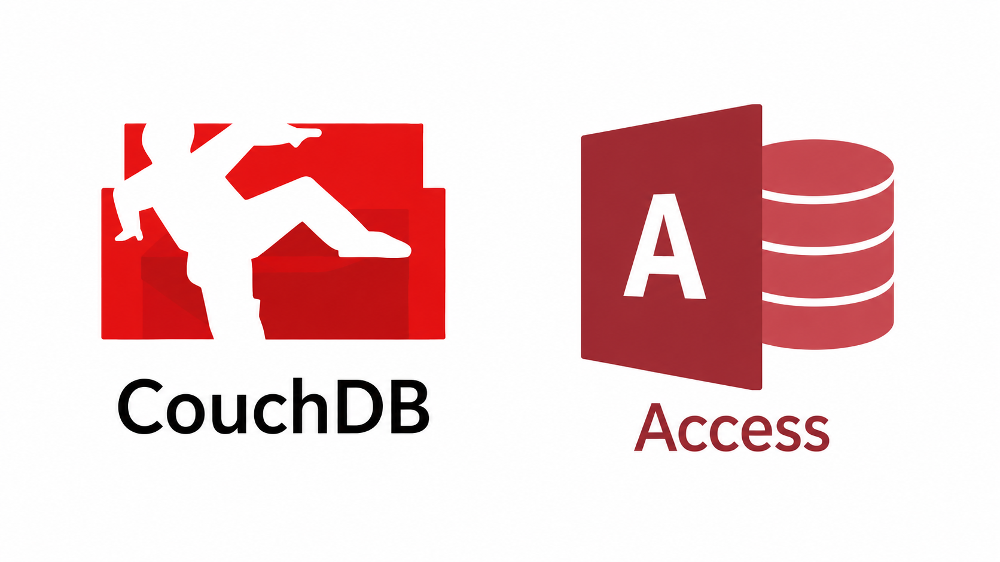
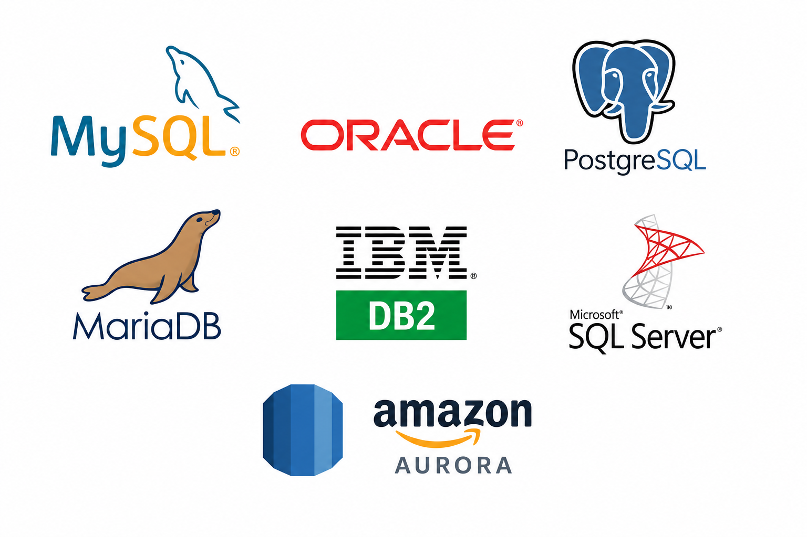

# Teoría clase I
## Definición
Según una definición clásica, una base de datos es un conjunto de datos -de un mismo contexto- organizados sistemáticamente.
Con la creación de sistemas informáticos se generó la necesidad de almacenar estos datos a nivel software.
Y aquí es cuando comenzamos a tener aplicaciones de bases de datos.

Tenemos aplicaciones sencillas que podemos utilizar de manera personal.
Algunos ejemplos son

1. CouchDB
2. Access

Cuando necesitamos que varios usuarios (decenas, cientos, miles) necesiten acceder consultar y manipular estos datos vamos a necesitar un servidor de base de datos

Tenemos servidores de base de datos de tipo relacional (que tienen álgebra relacional)
Algunos ejemplos son:

1. Oracle
2. MySQL
3. IBMDB2
4. SQL Server
5. PostGre SQL
6. Amazon Aurora  

Tenemos servidores de base de datos de tipo NO relacional (que NO cumplen con álgebra relacional)
Algunos ejemplos son:

1. MongoDB
2. Redis
3. Cassandra
4. Amazon Dynamo
5. Riak
6. BigTable  
